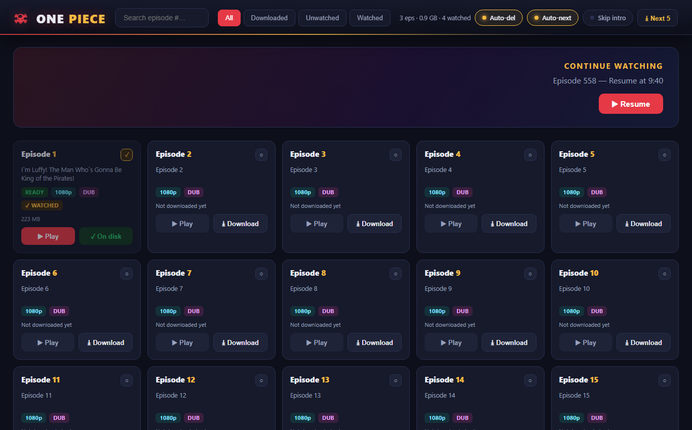
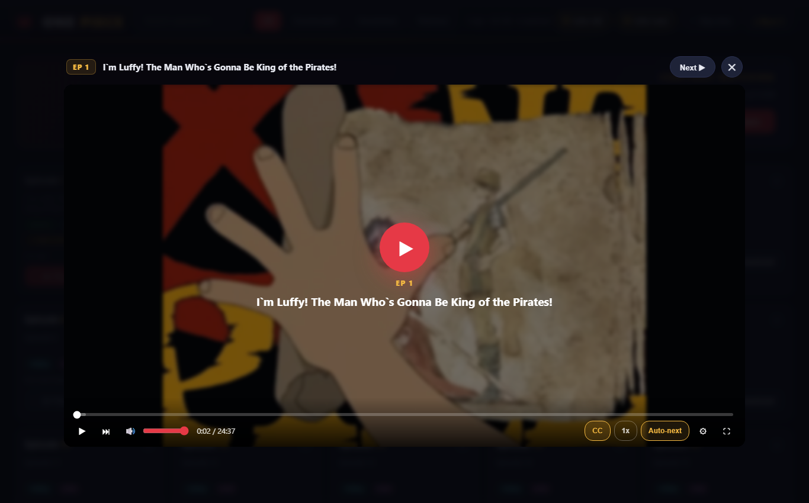
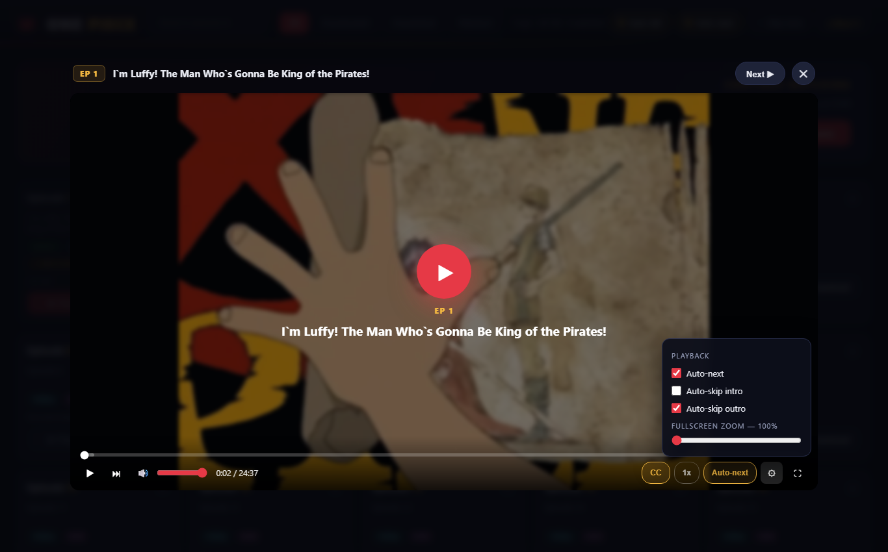
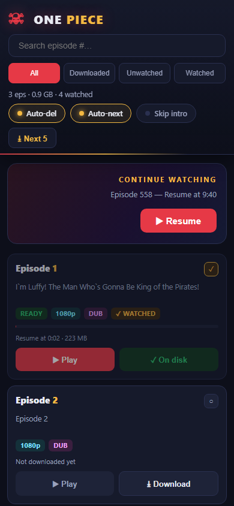

# one-piece-stream

A little self-hosted streaming server for One Piece. Downloads episodes in
1080p from an embed source, stitches them into a single mp4, and serves them
through a small netflix-style web ui on your local network. It keeps track of
what you watched, resumes where you left off, and quietly downloads the next
episode while you're watching the current one.

I made this for personal use so I could binge on a flight with no internet.
Don't use it to redistribute anything, it's all served on your own lan.

## screenshots

## how it works

the funny part: the stream segments from the cdn are actually png images with
the real mpeg-ts data appended after the image end marker. some kind of
hotlink protection. so the downloader fetches each "segment", cuts everything
up to and including the png IEND chunk, and concatenates what's left. ffmpeg
then remuxes the raw ts into mp4 without re-encoding.

getting the stream url needs a real browser (the site only hands out the
playlist to something that looks like chrome), so the downloader drives
headless chromium through playwright, listens for the internal getSources
call and pulls the master playlist url out of it. after that it's plain
requests, no browser needed.

the server is a single flask file. it does http range requests for seeking,
serves subtitles, and runs one background download at a time.

## features

- 1080p downloads (dub or sub), stitched to a clean mp4
- resume anywhere — per episode watch progress, survives restarts
- auto-mark episodes watched after 2 minutes
- auto-delete oldest watched episodes to keep disk usage down (toggle in header)
- continue watching banner always points at the furthest episode you reached
- custom player controls that also work in fullscreen:
  - seek bar with buffered indicator, volume, playback speed menu
  - subtitle settings: on/off, timing offset, text size, background opacity
  - skip intro / skip outro buttons (timestamps come from the source)
  - auto-next rolls into the next episode at the start of the outro
- downloads the next episode automatically once you're ~2 minutes into one
- phone friendly layout, add to home screen

## setup

needs python 3.10+, ffmpeg on PATH, and a chrome install for playwright:

    pip install flask requests playwright
    python -m playwright install chromium

run it:

    python server.py

then open http://localhost:8000 (or http://your-pc-ip:8000 from your phone).
downloads folder and watched state are created automatically.

## config

`config.json` (optional):

    { "last_episode": 1150, "auto_delete": true }

`server.py` constants worth knowing:

    WATCH_AFTER_SEC = 120   # seconds of watching before an ep counts as watched
    KEEP_WATCHED    = 2     # how many watched eps to keep on disk

## notes

- downloads run one at a time on purpose, the source cdn is not a fan of
  parallel hammering
- if a download fails mid-way just hit retry on the episode card
- the stream tokens expire fast, so the downloader re-resolves the playlist
  for every episode

## files

    server.py    flask app: api, streaming, download queue, watch state
    dl.py        the downloader (playwright + requests + ffmpeg)
    static/      the ui (plain html/css/js, no framework)
    start.bat    windows shortcut that starts the server and opens the browser